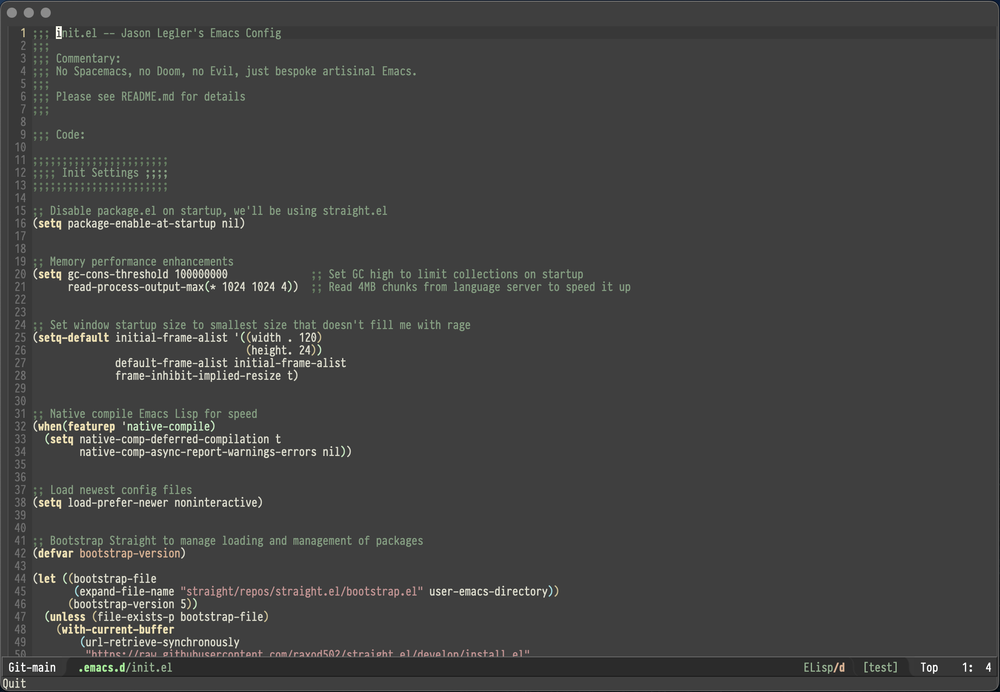
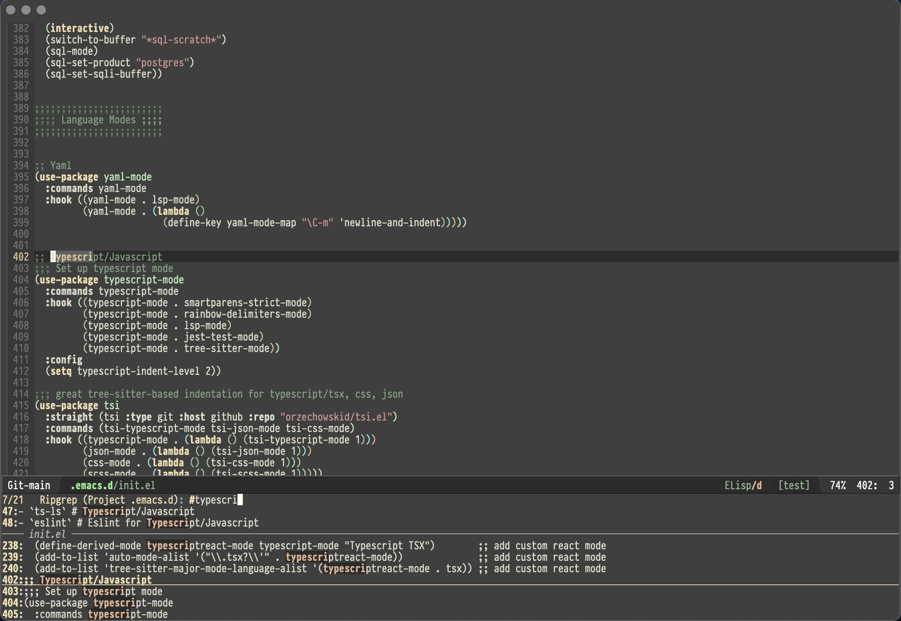

# SmashedToAtoms Emacs Config

No Spacemacs, no Doom, no Evil, just bespoke artisinal Emacs.

## Current Problems

### ts-ls (minor)

When you install the ts-ls language server for Typescript, it usually won't
work.  To make it behave, I have to cd to
`/.emacs.d/.cache/lsp/npm/typescript-language-server/lib/node_modules/typescript-language-server`
and run `npm install` in that directory.  It works fine once you do that.  Emacs
dependence on vscode libs is concerning.

### dap-mode (minor)

I only have dap-mode debugging working for Elixir at this point.  I am confident
I can get it working in Go and Rust.  I am less confident I can get it to work
in Typescript as it is dependent on a deprecated vscode project, and if I have
to do that, I may as well spin up vscode.  If you don't use a debugger, this
should all just work once the prerequisites are installed.

## Prerequisites

_These all need to be installed if you want everything to work with these
settings.  Feel free to leave ones out that you don't think you'll use, but be
aware that things will get weird if you try to use those packages without their
underlying dependencies._

- [Emacs](https://www.gnu.org/) - Emacs, I use [this
  one](https://github.com/d12frosted/homebrew-emacs-plus#emacs-29)
- [ripgrep](https://github.com/BurntSushi/ripgrep) - search: `brew install
  ripgrep`
- [pandoc](https://pandoc.org/) - Markdown renderer: `brew install pandoc`
- [aspell](http://aspell.net/) - Spell checker: `brew install aspell`
- [direnv](https://direnv.net/) - Environment variable manager: `brew install direnv`
- [PragmataPro](https://github.com/fabrizioschiavi/pragmatapro) - My favorite
  programming font
- [clj-kondo](https://github.com/clj-kondo/clj-kondo) - Clojure linter: `brew
  install clj-kondo`
- [go language server](https://github.com/golang/tools/tree/master/gopls) - go
  lsp server: `go install golang.org/x/tools/gopls@latest`
- [lsp-pylsp and black](https://emacs-lsp.github.io/lsp-mode/page/lsp-pylsp/) -
  python lsp server and linter: `pip install
  'python-lsp-server[all]' black`
- [zig tools](https://github.com/zigtools/zls) - zig lsp server
- [chatGPT](https://github.com/acheong08/ChatGPT/wiki/Setup) - experiment
  chatGPT client

## How does one use this?

Clone this into your ~/.emacs.d directory and start up Emacs.  It should
auto-download everything and install it.  It will take a few minutes the first
time, but after that it should start up in under a few seconds.  After that make
sure you check out [the next section](#what-about-lsp-support).

## What about LSP support?

If you're using a language for a language where emacs lsp handles the
installation, you will have to choose the language server you want to install.
Typescript will require you to install two, one for the language, and one for
the linter.  The rest should work with the defaults.  It will ask you to install
a language server the first time you edit a file with a candidate for all
languages that this config supports other than Go and Zig.  These are the ones I
use:

- `ts-ls` # Typescript/Javascript
- `eslint` # Eslint for Typescript/Javascript
- `json-ls` # Json
- `tailwindcss` # CSS linting for tailwind
- `rust-analyzer` # Rust
- `elixir-ls` # Elixir
- `yamlls` # Yaml
- `html-ls` # Html
- `css-ls` # Css
- `clojure-lsp` # Clojure
- `clangd` # Clang

## What's up with [Straight](https://github.com/radian-software/straight.el)

I use [straight](https://github.com/radian-software/straight.el) as a package
manager instead of the built-in `package.el`.  I do it primarily to make it
easier to control/identify what is running in different modes so I can identify
what is failing more quickly when things fail.  It also improves startup
times.Straight also lets me [pin versions with a lock
file](https://github.com/radian-software/straight.el#configuration-reproducibility).

## How do I change the font and theme?

If you want to change the look and feel, search the init.el file for `Global
Look and Feel` and modify what you find in that section.  You will likely need
to do this if you don't use Pragmata Pro as a font or like Zenburn as a theme.

## What about all the cool UI stuff?

I have turned almost all of it off.  It's Emacs, it's supposed to look like
this.  This config tries not to use sideline or popups for any messaging.  When
I encounter them, I try to shut them off and just use the modeline or a separate
buffer as much as possible.

